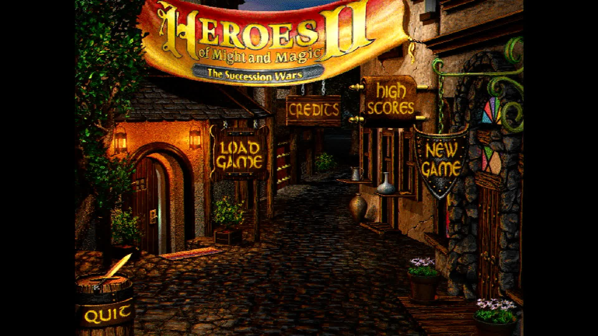

# pi-fheroes2

**Heroes of Might and Magic II running directly on a Raspberry Pi with no
operating system.** The board powers on and the game is what boots: no Linux,
no desktop, no launcher, and nothing else running beside it.

It builds for the Raspberry Pi 3, Pi 4 and Pi 5, all three from one source
tree.

## What this is

[fheroes2](https://github.com/ihhub/fheroes2) is a recreation of the Heroes of
Might and Magic II game engine, written from scratch in C++ and built on SDL2.
It is actively developed and released about once a month. This repository is
the thin layer that lets it run with nothing underneath: a
[Circle](https://github.com/rsta2/circle) kernel that brings the board up, and
[circle-libsdl2](https://github.com/Xalior/circle-libsdl2), an SDL2
implementation built on Circle's bare-metal drivers.

The game's own source is not copied or modified here. It is a submodule,
pinned at an upstream release, and the build reads it without ever writing to
it. Where the game needs something the SDL2 layer does not provide, this
repository supplies it in `host/` rather than changing the game.



*The title screen, captured from the Pi 5's HDMI output. The board is running
this image and nothing else — no kernel underneath it, no window system, no
launcher.*

The game draws at 640x480, the size Heroes II was drawn for, and the picture
is scaled once onto whatever your screen actually is.

## What works

The game starts, reads its data from the card and draws — the screenshot above
is its own output. The menus respond to the mouse.

**Playing a full game has not been confirmed on hardware.** Everything past
the menus is untried rather than known to work, and this is the port to be
sceptical about.

What is missing:

- **Sound and music.** The game runs in silence.
- **Screenshots and image import.** The map editor's image import and the
  screenshot key both fail.

## What you need to supply

**This repository contains no Heroes of Might and Magic II data, and cannot.**
The graphics, the sounds, the maps and the campaign text live in files that
are not part of the fheroes2 engine and are not this project's to distribute.
Building the images does not download them, and neither does writing a card.

You need, at a minimum:

| File | What it is |
|---|---|
| `HEROES2.AGG` | The game's main data archive. Required. |
| `HEROES2X.AGG` | The data archive for the *Price of Loyalty* expansion. Optional, and only if you own it. |
| One or more `.MP2` files | Scenario maps. |

Where to get them legitimately:

- **The official demo, and `make media` fetches it for you.** New World
  Computing released a demo of Heroes II in 1996 and it has been freely
  distributed ever since. It carries a complete `HEROES2.AGG` and one playable
  scenario, which is enough to start the game and play a map. See
  [The demo, and `make media`](#the-demo-and-make-media) below.
- **The full game.** Use the copy inside a version you own. The original CD,
  and the GOG release, both install these files as plain files; copying them
  to the card is all that is needed.

Do not use a copy obtained by working around a licence, a paywall or a
copy-protection system. There is a free and complete-enough option above.

### The demo, and `make media`

```sh
make media
```

This downloads the 1996 demo into `media/`, and it is the only target in this
repository that downloads anything at all.

| | |
|---|---|
| **What it fetches** | `h2demo.zip`, the official New World Computing / 3DO demo of *Heroes of Might and Magic II: The Succession Wars*. |
| **From where** | `https://archive.org/download/HeroesofMightandMagicIITheSuccessionWars_1020/h2demo.zip` |
| **Under what terms** | The demo was distributed freely to promote the retail game and is still hosted on those terms. It is **not** the retail data, and this repository does not redistribute it. |
| **How it is verified** | Against a published SHA256. The URL and the checksum are both copied from fheroes2's own `script/demo/download_demo_version.sh`, so the integrity check is upstream's, made for this exact archive — not one invented here. A mismatch stops the target and the file is never staged. |

It unpacks the archive's `DATA/` and `MAPS/` into `media/data/` and
`media/maps/`, discards the Windows installer and its DLLs, which fheroes2
has no use for, and writes `media/provenance.txt` recording the URL, the
date, the checksum and the licence.

Re-running it verifies what is already there instead of downloading again.
`media/` is not tracked by git and no build target deletes it.

If you own the retail game, you do not need this: put your own `HEROES2.AGG`
in `media/data/` and `make card` will stage it exactly the same way.

### Where the files go

The game reads everything from one directory on the card, `/games/fheroes2`,
laid out the way fheroes2 lays it out everywhere else:

```
/games/fheroes2/
    fheroes2.cfg             the game's settings (staged by `make card`)
    data/HEROES2.AGG         from media/, or supplied by you
    data/HEROES2X.AGG        you supply, expansion only
    maps/*.MP2               from media/, or supplied by you
    maps/*.fh2m              scenarios written for fheroes2 (staged)
    files/data/*.h2d         fheroes2's own asset files (staged)
    files/save/              save games, created by the game
```

`make card` builds exactly that layout under `build/sd-card/`, and the kernel
enters `/games/fheroes2` before the game starts, so every relative path the
game opens lands inside it. One card carries several games, and nothing of
this port's ever touches the card's root.

## Building

You need a Linux or macOS machine, GNU make, and the Arm GNU toolchain for
`aarch64-none-elf` (release 15.2.Rel1). Put its `bin` directory on your
`PATH`, or unpack it into `toolchains/` in this repository.

```sh
git clone --recursive https://github.com/Xalior/pi-fheroes2.git
cd pi-fheroes2
make deps       # long: builds newlib and libc++ from source, once per board
make kernels    # the three board images
make verify     # confirms each image exists and is not empty
make media      # the freely distributed 1996 demo data
make card       # stages the card, data included if media/ has any
```

`make deps` is the slow step, and it is slow once. It builds a complete C and
C++ world for each board, because each board's world is compiled for its own
processor.

Part of that world is libc++, whose sources are fetched from a git tag that
carries the bare-metal patches. That tag is hosted on Codeberg, which is small
and volunteer run. One copy is enough for every board and for every project on
your machine, so tell the build where to keep it and it is fetched once:

```sh
make deps CIRCLE_LLVM=/path/to/circle-llvm
```

The default puts that checkout beside this repository, which is the right
answer for a plain clone or a continuous-integration runner and needs no
setting at all.

The images land in `host/build/<board>/`:

| Board | Image |
|---|---|
| Pi 3 | `host/build/rpi3/kernel8.img` |
| Pi 4 | `host/build/rpi4/kernel8-rpi4.img` |
| Pi 5 | `host/build/rpi5/kernel_2712.img` |

Building one board on its own is `make rpi5`, and its dependencies alone are
`make deps-rpi5`, which is what a machine without room for three worlds wants.

## Putting it on a card

```sh
make card
```

That stages the card into `build/sd-card/` for you to copy onto FAT32 media:
the three kernel images under the names each board's firmware looks for, the
boot configuration, the game's settings, the data files fheroes2 ships itself
and is free to redistribute, and whatever `media/` holds.

**`make card` never downloads anything**, and it does not depend on `make
media`. Run without the data it stages a complete card except for the game's
files and names what is missing, which is a legitimate build and is what
continuous integration produces.

One thing is never staged and has to be added by hand: **the Raspberry Pi
firmware files** — `bootcode.bin`, `start*.elf`, `fixup*.dat` and, for the
Pi 4, `armstub8-rpi4.bin`. Take them from a Raspberry Pi OS card or from the
[firmware repository](https://github.com/raspberrypi/firmware).

### The settings file

`games/fheroes2/fheroes2.cfg` is staged with settings this port needs, and
each one is commented in the file itself. Two are worth knowing about:

- **Both volumes are zero**, because there is no sound. Turning them up
  changes nothing that can be heard.
- **The introduction videos are off**, so the first menu arrives quickly. Turn
  them on once you are happy the board is running.

fheroes2 rewrites this file when it exits, so a change made on the card is the
starting point rather than a permanent setting.

### Keeping it cool

The card carries `cmdline.txt`, which sets the temperature the board is
allowed to reach and the pin its fan is on:

    socmaxtemp=70 gpiofanpin=45

Pin 45 is the Raspberry Pi 5 Case Fan and Active Cooler. With a fan named,
reaching 70°C switches the fan on and the processor keeps running at full
speed. Without one it would be slowed down instead, and a slowed processor
drops frames.

If your fan is wired somewhere else, change the pin number.

## License

The code in this repository — the kernel layer in `host/` and the build — is
released under the GNU Lesser General Public License, version 3. See
[LICENSE](LICENSE).

The submodules are other people's work and carry their own terms, and all of
them matter before you distribute anything you build here:

- **fheroes2** is released under the GNU General Public License, version 2 or
  later.
- **Circle** is released under the GNU General Public License, version 3.
- **zlib** is released under the zlib licence.

Building a kernel image here combines all of them, and the result is covered
by the GNU General Public License, version 3. Doing that for yourself is
straightforward; redistributing the result means satisfying every one of those
terms at once, including supplying complete source.

Heroes of Might and Magic is a trademark of Ubisoft Entertainment. This
project is not affiliated with Ubisoft, with the former New World Computing,
or with the fheroes2 project.
